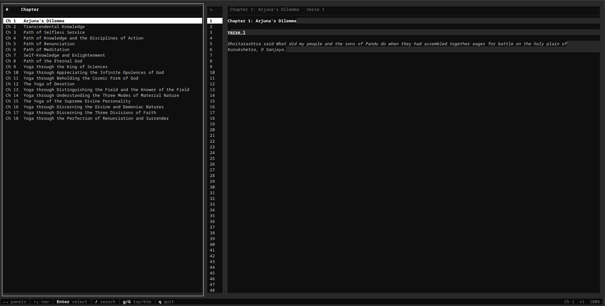

# Gita-cli

[](https://go.dev/dl/)
[](./LICENSE)
[](https://github.com/ACS-lessgo/gita-cli/releases/latest)

> Access the timeless wisdom of the **Bhagavad Gita** directly from your terminal.

A fast, beautifully formatted, open-source CLI tool built in Go.

## Contents

- [Screenshots](#screenshots)
- [Installation](#-installation)
- [Features](#-features)
- [Interactive TUI](#️-interactive-tui)
- [CLI Usage](#-cli-usage)
- [Contributing](#-contributing)
- [License](#-license)

## Screenshots

**Splash screen**


**Interactive reader**



---

## 📦 Installation

### Linux / macOS — one-liner

```bash
curl -fsSL https://raw.githubusercontent.com/ACS-lessgo/gita-cli/main/install.sh | bash
```

Then run:

```bash
gita
```

---

### Windows — one-liner (PowerShell)

If windows has blocked remote install just run the below command in powershell fist

```bash
Set-ExecutionPolicy RemoteSigned -Scope CurrentUser
```

```bash
irm https://raw.githubusercontent.com/ACS-lessgo/gita-cli/main/install.ps1 | iex
```

### Windows — manual install

1. Go to the [Releases page](https://github.com/ACS-lessgo/gita-cli/releases/latest)
2. Download `gita-windows-amd64.exe`
3. Rename it to `gita.exe`
4. Move it somewhere on your PATH, for example `C:\Windows\System32\` — or follow the steps below to add a custom folder

**Adding to PATH on Windows (recommended):**

```powershell
# Run in PowerShell as Administrator
# 1. Create a folder for your CLI tools
New-Item -ItemType Directory -Force -Path "C:\tools"

# 2. Move the downloaded binary there (adjust path as needed)
Move-Item "$HOME\Downloads\gita-windows-amd64.exe" "C:\tools\gita.exe"

# 3. Add C:\tools to your PATH permanently
[Environment]::SetEnvironmentVariable(
  "PATH",
  $env:PATH + ";C:\tools",
  [EnvironmentVariableTarget]::Machine
)
```

Open a new terminal and run `gita`.

---

### Build from source

Requires [Go 1.22+](https://go.dev/dl/)

```bash
git clone https://github.com/ACS-lessgo/gita-cli.git
cd gita-cli
go mod tidy
go build -o gita .
./gita
```

---

## ✨ Features

| Command | Description |
|---|---|
| `gita verse <chapter> <verse>` | Retrieve a specific verse |
| `gita chapter <number>` | Display all verses in a chapter |
| `gita random` | Show a random verse |
| `gita search <keyword>` | Search verses by keyword |
| `gita quote` | Display an inspiring daily quote |

- 🎨 **Beautiful terminal output** with colors and borders (via `lipgloss`)
- ⚡ **Embedded data** — no external API calls, works fully offline
- 🔍 **Fast keyword search** across all 700 verses
- 🧪 **Unit tested** core functions
- 🛡️ **Error handling** for invalid chapters/verses

---

## 🖥️ Interactive TUI

Run `gita` with no arguments to launch the full-screen interactive browser:

```
┌──────────────────────────────────────────┐ ┌──────┐ ┌──────────────────────────────────────────────┐
│ #     Chapter                            │ │ v.   │ │ Chapter 2: The Yoga of Knowledge  Verse 47   │
│──────────────────────────────────────────│ │──────│ │──────────────────────────────────────────────│
│ Ch 1   Arjuna's Dilemma                  │ │   1  │ │                                              │
│ Ch 2   The Yoga of Knowledge             │ │   2  │ │ Chapter 2: The Yoga of Knowledge             │
│▶Ch 3   The Yoga of Action                │ │  ▶47 │ │                                              │
│ Ch 4   The Yoga of Wisdom                │ │  48  │ │ Verse 47                                     │
│ Ch 5   The Yoga of Renunciation          │ │  55  │ │                                              │
│ Ch 6   The Yoga of Meditation            │ │  62  │ │ You have a right to perform your prescribed  │
│ ...                                      │ │  63  │ │ duty, but you are not entitled to the fruits │
│                                          │ │      │ │ of action...                                 │
└──────────────────────────────────────────┘ └──────┘ └──────────────────────────────────────────────┘
 ←→ panels  ↑↓ navigate  Enter select  / search  g/G top/bottom  q quit
```

### TUI Key Bindings

| Key | Action |
|---|---|
| `←` / `→` or `h` / `l` | Switch panels |
| `↑` / `↓` or `k` / `j` | Navigate items |
| `Enter` or `Space` | Move focus right |
| `g` / `G` | Jump to top / bottom |
| `/` | Open search |
| `n` / `N` | Next / previous search result |
| `Esc` | Clear search |
| `q` | Quit |

---

## 💻 CLI Usage

```bash
# Launch interactive TUI
gita

# Read a specific verse
gita verse 2 47

# Show all verses in a chapter
gita chapter 6

# Random verse
gita random

# Search across all 700 verses
gita search "duty"
gita search "soul" --limit 10

# Daily quote
gita quote
```

---

## 🤝 Contributing

Contributions are welcome! Feel free to open issues or pull requests.

```bash
git clone https://github.com/ACS-lessgo/gita-cli.git
cd gita-cli
go mod tidy
go test ./...        # run tests
go build -o gita .   # build
```

---

## 📄 License

MIT © [ACS-lessgo](https://github.com/ACS-lessgo)

---

<p align="center">
  <i>"You have the right to perform your actions,<br>
  but you are not entitled to the fruits."</i><br>
  — Bhagavad Gita 2.47
</p>